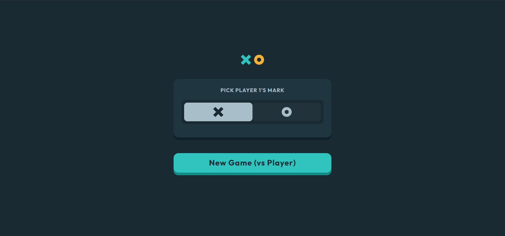
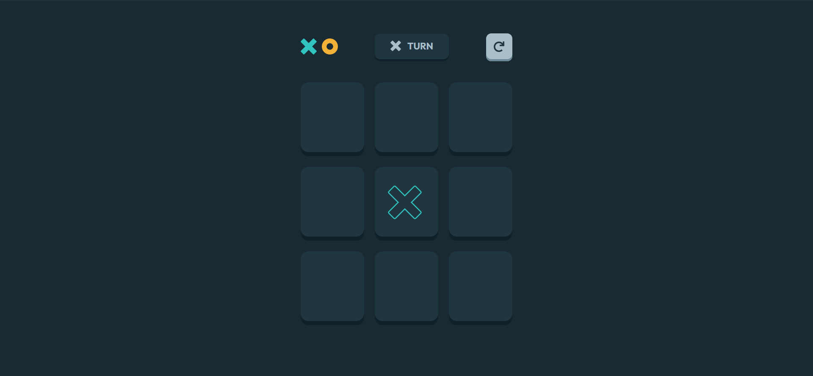
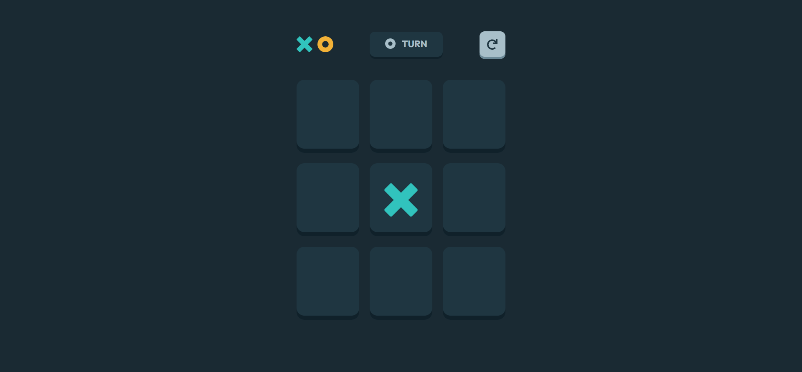
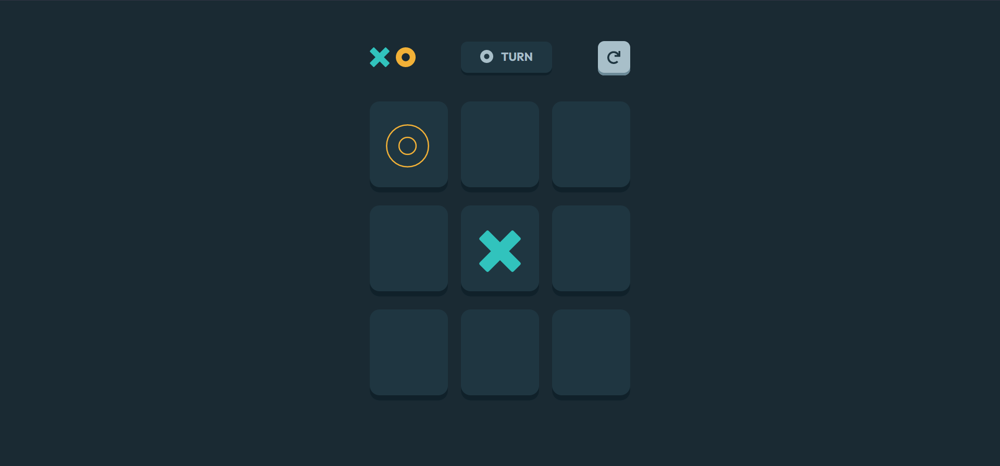
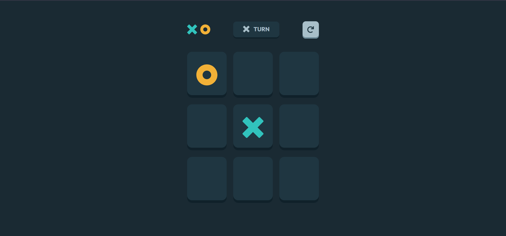
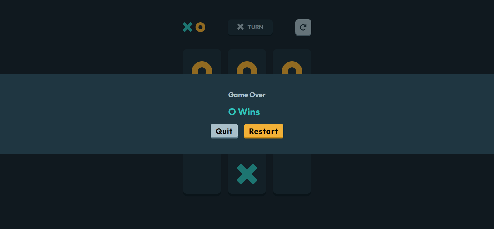
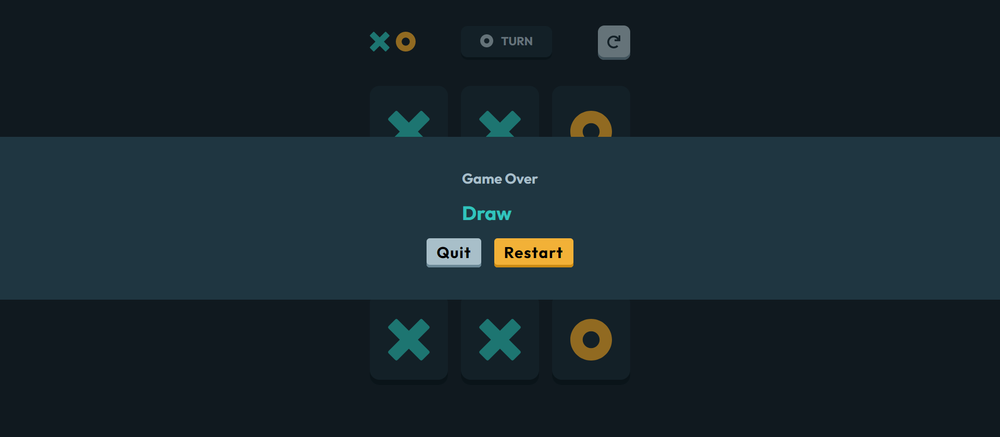

# Frontend Mentor - Interactive rating component solution

This is a solution to the [Tic Tac Toe game challenge on Frontend Mentor](https://www.frontendmentor.io/challenges/tic-tac-toe-game-Re7ZF_E2v).

## Table of contents

- [Overview](#overview)
  - [The challenge](#the-challenge)
  - [Screenshot](#screenshot)
  - [Links](#links)
- [My process](#my-process)
  - [Built with](#built-with)
- [Author](#author)

## Overview

### The challenge

Users should be able to:

- View the optimal layout for the app depending on their device's screen size
- See hover states for all interactive elements on the page
- First Player should be able to select either to play with X or O
- See the game board after creating new game.
- Player could restart/reset the board.
- Player should see game over pop up when he finish the match (Win - Draw).
- Player could quit the match / or restart when the game is over.

### Screenshot

### Links

- Solution URL: [Tic Tac Toe Game - Github URL](https://github.com/MouhsineNejmi/tic-tac-toe)
- Live Site URL: [Tic Tac Toe Game - Live URL](https://tic-tac-toe-lake-eta.vercel.app/)

## My process

### Built with

- [React](https://reactjs.org/) - JS library
- [Styled Components](https://styled-components.com/) - CSS In JS

## Author

- My Name is Mouhsine NEJMI and I'm a Frontend Developer. I love coding and to challenge myself to solve coding problems.
- Mail - [nejmi.mouhcine10@gmail.com](mailto:nejmi.mouhcine10@gmail.com)
